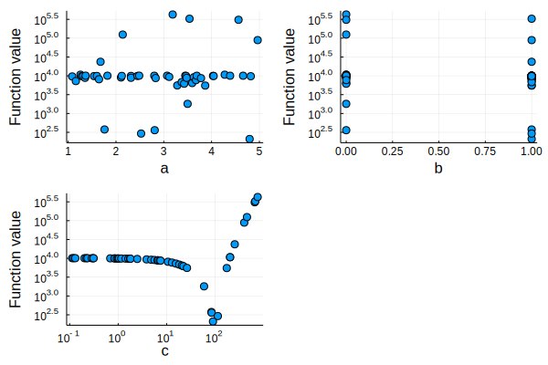

# Hyperopt

[](https://github.com/baggepinnen/Hyperopt.jl/actions)
[](http://codecov.io/github/baggepinnen/Hyperopt.jl?branch=master)


A package to perform hyperparameter optimization. Currently supports random search, [latin hypercube sampling](https://en.wikipedia.org/wiki/Latin_hypercube_sampling) and [Bayesian optimization](https://arxiv.org/abs/1807.02811).

# Usage

This package was designed to facilitate the addition of optimization logic to already existing code. I usually write some code and try a few hyper parameters by hand before I realize I have to take a more structured approach to finding good hyper parameters. I therefore designed this package such that the optimization logic is wrapped around existing code, and the user only has to specify which variables to optimize and candidate values (ranges) for these variables.

## High-level example
In order to add hyper-parameter optimization to the existing pseudo code
```julia
a = manually_selected_value
b = other_value
cost = train_model(a,b)
```
we wrap it in `@hyperopt` like this
```julia
ho = @hyperopt for i = number_of_samples,
                   a = candidate_values,
                   b = other_candidate_values
cost = train_model(a,b)
end
```

## Details

1. The macro `@hyperopt` takes a for-loop with an initial argument determining the number of samples to draw (`i` below).
2. The sample strategy can be specified by specifying the special keyword `sampler = Sampler(opts...)`. Available options are `RandomSampler()`, `LHSampler()`, `CLHSampler(dims=[Continuous(), Categorical(2), Continuous(), ...])`, `Hyperband(R=50, η=3, inner=RandomSampler())`.
3. The subsequent arguments to the for-loop specifies names and candidate values for different hyper parameters (`a = LinRange(1,2,1000), b = [true, false], c = exp10.(LinRange(-1,3,1000))` below).
4. A useful strategy to achieve log-uniform sampling is logarithmically spaced vector, e.g. `c = exp10.(LinRange(-1,3,1000))`.
5. In the example below, the parameters `i,a,b,c` can be used within the expression sent to the macro and they will hold a new value sampled from the corresponding candidate vector each iteration.

The resulting object `ho::Hyperoptimizer` holds all the sampled parameters and function values and has `minimum/minimizer` and `maximum/maximizer` properties (e.g., `ho.minimizer`). It can also be plotted using `plot(ho)` (uses `Plots.jl`). The exact syntax to use for various samplers is shown in the [testfile](https://github.com/baggepinnen/Hyperopt.jl/blob/master/test/runtests.jl), which should be fairly readable.


## Full example
```julia
using Hyperopt

f(x,a,b=true;c=10) = sum(@. x + (a-3)^2 + (b ? 10 : 20) + (c-100)^2) # Function to minimize

# Main macro. The first argument to the for loop is always interpreted as the number of iterations
ho = @hyperopt for i=50,
            sampler = RandomSampler(), # This is default if none provided
            a = LinRange(1,5,1000),
            b = [true, false],
            c = exp10.(LinRange(-1,3,1000))
   print(i, "\t", a, "\t", b, "\t", c, "   \t")
   x = 100
   @show f(x,a,b,c=c)
end
1   3.910910910910911   false   0.15282140360258697     f(x, a, b, c=c) = 10090.288832348499
2   3.930930930930931   true    6.1629662551329405      f(x, a, b, c=c) = 8916.255534433481
3   2.7617617617617616  true    146.94918006248173      f(x, a, b, c=c) = 2314.282265997491
4   3.6666666666666665  false   0.3165924111983522      f(x, a, b, c=c) = 10057.226192959602
5   4.783783783783784   true    34.55719936762139       f(x, a, b, c=c) = 4395.942039196544
6   2.5895895895895897  true    4.985373463873895       f(x, a, b, c=c) = 9137.947692504491
7   1.6206206206206206  false   301.6334347259197       f(x, a, b, c=c) = 40777.94468684398
8   1.012012012012012   true    33.00034791125285       f(x, a, b, c=c) = 4602.905476253546
9   3.3583583583583585  true    193.7703337477989       f(x, a, b, c=c) = 8903.003911886599
10  4.903903903903904   true    144.26439512181574      f(x, a, b, c=c) = 2072.9615255755252
11  2.2332332332332334  false   119.97177354358843      f(x, a, b, c=c) = 519.4596697509966
12  2.369369369369369   false   117.77987011971193      f(x, a, b, c=c) = 436.52147646611473
13  3.2182182182182184  false   105.44427935261685      f(x, a, b, c=c) = 149.68779686009242
⋮

Hyperopt.Hyperoptimizer
  iterations: Int64 50
  params: Tuple{Symbol,Symbol,Symbol}
  candidates: Array{AbstractArray{T,1} where T}((3,))
  history: Array{Any}((50,))
  results: Array{Any}((50,))
  sampler: Hyperopt.RandomSampler


julia> best_params, min_f = ho.minimizer, ho.minimum
(Real[1.62062, true, 100.694], 112.38413353985818)

julia> printmin(ho)
a = 1.62062
b = true
c = 100.694
```

We can also visualize the result by plotting the hyperoptimizer
```
plot(ho)
```


This may allow us to determine which parameters are most important for the performance etc.


The type `Hyperoptimizer` is iterable, it iterates for the specified number of iterations, each iteration providing a sample of the parameter vector, e.g.
```julia
ho = Hyperoptimizer(10, a = LinRange(1,2,50), b = [true, false], c = randn(100))
for (i,a,b,c) in ho
    println(i, "\t", a, "\t", b, "\t", c)
end

1   1.2244897959183674  false   0.8179751164732062
2   1.7142857142857142  true    0.6536272580487854
3   1.4285714285714286  true    -0.2737451706680355
4   1.6734693877551021  false   -0.12313108128547606
5   1.9795918367346939  false   -0.4350837079334295
6   1.0612244897959184  true    -0.2025613848798039
7   1.469387755102041   false   0.7464858339748051
8   1.8571428571428572  true    -0.9269021128132274
9   1.163265306122449   true    2.6554272337516966
10  1.4081632653061225  true    1.112896676939024
```

If used in this way, the hyperoptimizer **can not** keep track of the function values like it did when `@hyperopt` was used. To manually store the same data, consider a pattern like
```julia
ho = Hyperoptimizer(10, a = LinRange(1,2), b = [true, false], c = randn(100))
for (i,a,b,c) in ho
    res = computations(a,b,c)
    push!(ho.history, [a,b,c])
end
```

# Categorical variables
`RandomSampler` and `CLHSampler` support categorical variables which do not have a natural floating point representation, such as functions:
```julia
@hyperopt for i=20, fun = [tanh, σ, relu]
    train_network(fun)
end
# or
@hyperopt for i=20, sampler=CLHSampler(dims=[Categorical(3), Continuous()]),
                    fun   = [tanh, σ, relu],
                    param = LinRange(0,1,20)
    train_network(fun, param)
end
```

# Which sampler to use?
`RandomSampler` is a good baseline and the default if none is chosen. `Hyperband(R=50, η=3, inner=RandomSampler())` runs the expression with varying amount of resources, allocating more resources to promising hyperparameters. See below for more info on `Hyperband`.

If number of iterations is small, `LHSampler` work better than random search. Caveat: `LHSampler` needs all candidate vectors to be of equal length, i.e.,
```julia
hob = @hyperopt for i=100, sampler = LHSampler(),
                            a = LinRange(1,5,100),
                            b = repeat([true, false],50),
                            c = exp10.(LinRange(-1,3,100))
    f(a,b,c=c)
end
```
where all candidate vectors are of length 100. The candidates for `b` thus had to be repeated 50 times.

The categorical `CLHSampler` circumvents this
```julia
hob = @hyperopt for i=100,
                    sampler=CLHSampler(dims=[Continuous(), Categorical(2), Continuous()]),
                    a = LinRange(1,5,100),
                    b = [true, false],
                    c = exp10.(LinRange(-1,3,100))
    f(a,b,c=c)
end
```


## Hyperband
`Hyperband(R=50, η=3, inner=RandomSampler())` Implements [Hyperband: A Novel Bandit-Based Approach to Hyperparameter Optimization](https://arxiv.org/abs/1603.06560). The maximum amount of resources is given by `R` and the parameter `η` roughly determines the proportion of trials discarded between each round of successive halving. When using `Hyperband` the expression inside the `@hyperopt` macro takes the following form
```julia
ho = @hyperopt for i=18, sampler=Hyperband(R=50, η=3, inner=RandomSampler()), a = LinRange(1,5,1800), c = exp10.(LinRange(-1,3,1800))
    if state === nothing # Query if state is initialized
        res = optimize(resources=i, a, b) # if state is uninitialized, start a new optimization using the selected hyper parameters
    else
        res = optimize(resources=i, state=state) # If state has a value, continue the optimization from the state
    end
    minimum(res), get_state(res) # return the minimum value and a state from which to continue the optimization
end
```
a (simple) working example using `Hyperband` and Optim is
```julia
using Optim
f(a;c=10) = sum(@. 100 + (a-3)^2 + (c-100)^2)
hohb = @hyperopt for i=18, sampler=Hyperband(R=50, η=3, inner=RandomSampler()), a = LinRange(1,5,1800), c = exp10.(LinRange(-1,3,1800))
    if state !== nothing
        a,c = state
    end
    res = Optim.optimize(x->f(x[1],c=x[2]), [a,c], SimulatedAnnealing(), Optim.Options(f_calls_limit=i))
    Optim.minimum(res), Optim.minimizer(res)
end
plot(hohb)
```
and a more complicated example that also explores different Optim optimizers as the inner optimizer is
```julia
hohb = @hyperopt for i=18, sampler=Hyperband(R=50, η=3, inner=RandomSampler()),
    algorithm = [SimulatedAnnealing(), ParticleSwarm(), NelderMead(), BFGS(), NewtonTrustRegion()],
    a = LinRange(1,5,1800),
    c = exp10.(LinRange(-1,3,1800))
    if state !== nothing
        x0,algorithm = state
    else
        x0 = [a,c]
    end
    println(i, " algorithm: ", typeof(algorithm).name.name)
    res = Optim.optimize(x->f(x[1],c=x[2]), x0, algorithm, Optim.Options(time_limit=i+1, show_trace=false))
    Optim.minimum(res), (Optim.minimizer(res), algorithm)
end
```

### Function / vector interface
Hyperband can also be called by itself with a more standard optimizer interface.
In this case, the objective function takes a scalar `resources` and a vector of 
parameters, and returns the objective value and a vector of parameters.

Example:
```julia
using Hyperopt
using Optim: optimize, Options, minimum, minimizer
f(a;c=10) = sum(@. 100 + (a-3)^2 + (c-100)^2)

objective = function (resources::Real, pars::AbstractVector)
    res = optimize(x->f(x[1],c=x[2]), pars, SimulatedAnnealing(), Options(time_limit=resources/100))
    minimum(res), minimizer(res)
end

candidates = (a=LinRange(1,5,300), c=exp10.(LinRange(-1,3,300))) # A vector of vectors also works, but parameters will not get nice names in plots
hohb = hyperband(objective, candidates; R=50, η=3, threads=true)
```

## BOHB
[BOHB: Robust and Efficient Hyperparameter Optimization at Scale](https://arxiv.org/abs/1807.01774) refines Hyperband by replacing the random sampler by a bayesian-optimization-based sampler. Now you can use it by simply replace the sampler in `Hyperband` as `BOHB(dims=[<dims>...])`

### Example
```julia
using Optim
hb = @hyperopt for i=18, sampler=Hyperband(R=50, η=3, inner=RandomSampler()), a = LinRange(1,5,800), c = exp10.(LinRange(-1,3,1800))
    if state !== nothing
        a,c = state
    end
    res = Optim.optimize(x->f(x[1],c=x[2]), [a,c], NelderMead(), Optim.Options(f_calls_limit=i))
    Optim.minimum(res), Optim.minimizer(res)
end

# Using BOHB with same setting, remember to specify dimension types!
bohb = @hyperopt for i=18, sampler=Hyperband(R=50, η=3, inner=BOHB(dims=[Hyperopt.Continuous(), Hyperopt.Continuous()])), a = LinRange(1,5,800), c = exp10.(LinRange(-1,3,1800))
    if state !== nothing
        a,c = state
    end
    res = Optim.optimize(x->f(x[1],c=x[2]), [a,c], NelderMead(), Optim.Options(f_calls_limit=i))
    Optim.minimum(res), Optim.minimizer(res)
end
```


# Parallel execution
- The macro `@phyperopt` works in the same way as `@hyperopt` but distributes all computation on available workers. The usual caveats apply, code must be loaded on all workers etc.
- The macro `@thyperopt` uses `ThreadPools.tmap` to evaluate the objective on all available threads. Beware of high memory consumption if your objective allocates a lot of memory.
